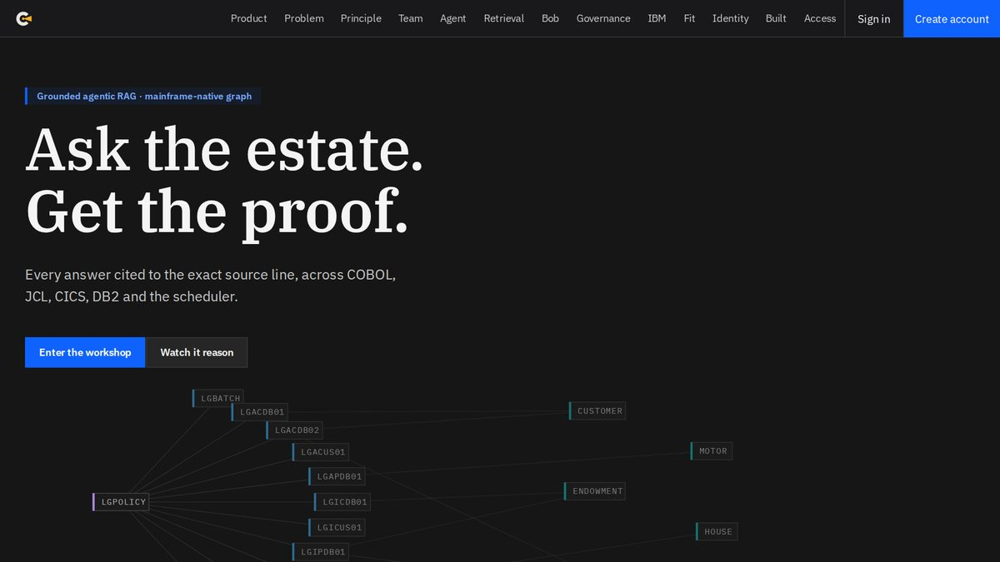
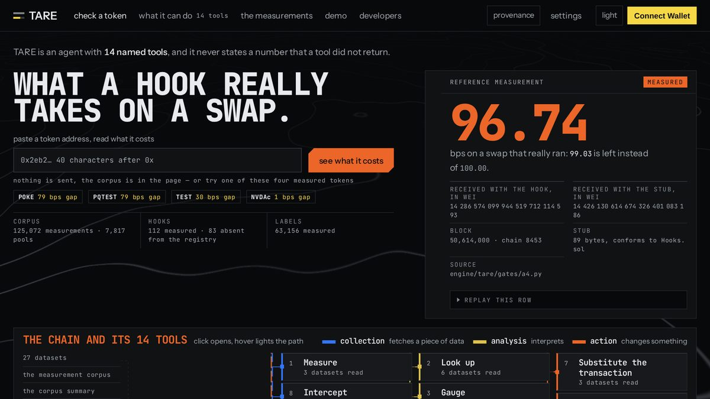
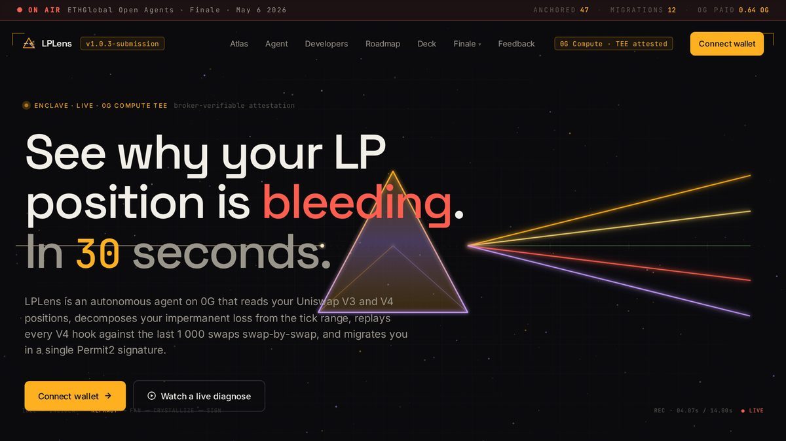
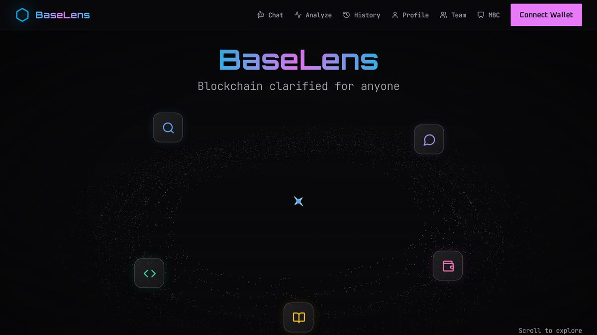
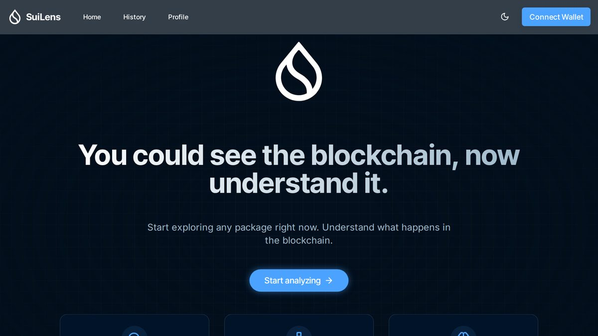
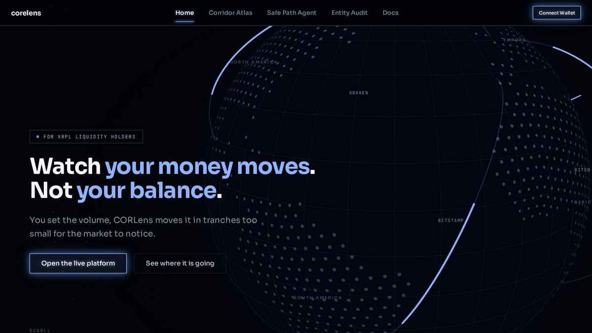

# Jean-Baptiste Durand — AI Engineer · RAG, agents & MCP

I build **retrieval systems and LLM agents that run in production** — hybrid search, tools exposed over MCP, answers grounded in the source, tested and measured.
By day I work on **z/OS mainframe at AXA**, which makes for an unusual pairing: COBOL × LLM agents.

**4 hackathons won** — ETHOnline 2026 (Uniswap Foundation prize) · ETHGlobal Open Agents 2026 · MBC 2025 Miami · SUI Paris 2025 · IBM AI Builders Challenge

```
RAG       chunking · hybrid search (vector + keyword) · reranking · evals · grounded citations
Agents    tool calling · MCP (server & client) · LangGraph · ReAct · guardrails & error recovery
Stack     Python · FastAPI · TypeScript · PostgreSQL/pgvector · Neo4j · Docker · GitHub Actions
Models    IBM Granite / watsonx.ai · BeeAI · OpenAI · Anthropic · embeddings
```

---

### [COBOL Explorer](https://cobol-explorer.fr) — ask a mainframe estate, get the proof

[](https://cobol-explorer.fr)

An entire COBOL estate — programs, paragraphs, copybooks, DB2 tables, CICS transactions, JCL jobs, scheduler chains — becomes a **dependency graph you query in plain language**, and every answer is cited down to the exact source line.

- **Hybrid retrieval**: deterministic graph traversal + vector search (Granite embeddings), ReAct orchestration with BeeAI
- **3 MCP tools** exposed to IBM Bob — `graph_lookup`, `search_code`, `read_source_lines`. The AI is audited like a colleague: roles, review, tamper-evident trail
- **Measured**: 158 backend + 51 e2e tests, green CI, 2 real estates indexed (339 and 1,157 nodes), impact analysis cut from days to ~30 seconds

`IBM Granite · watsonx.ai · BeeAI · MCP · Python · FastAPI` — [code](https://github.com/JeanBaptisteDurand/cobol-explorer) · [live](https://cobol-explorer.fr) · [3-min demo](https://youtu.be/oYf4kgc3fRo)

---

### [TARE](https://tare-hooks.tech) — what a Uniswap v4 hook really takes from your swap

[](https://tare-hooks.tech)

**125,072 replayable measurements.** You pick the route on a Ledger, with what each hook takes on screen, and only then does MetaMask open. Rates attested on Hedera. So you see what a hook takes, three seconds before you sign.

*ETHOnline 2026 — **Best Uniswap Stack Contribution**, 1 of 8 finalists out of 814 projects, 1,462 hackers, 89 countries.*

`Uniswap v4 hooks · Solidity · Ledger · Hedera · TypeScript` — [code](https://github.com/JeanBaptisteDurand/ETH_Online_2026) · [live](https://tare-hooks.tech) · [showcase](https://ethglobal.com/showcase/tare-ozced)

---

### [LPLens](https://lplens.xyz) — an agent that rescues bleeding LP positions

[](https://lplens.xyz)

An autonomous agent for Uniswap v3/v4 liquidity positions, with its **own ENS identity and on-chain memory**, on the 0G stack.

*ETHGlobal Open Agents 2026 — 1 of 7 finalists out of 468 projects, built solo.*

`0G · ENS · TypeScript · autonomous agents` — [code](https://github.com/JeanBaptisteDurand/Open_Agent_2026) · [live](https://lplens.xyz)

---

### [BaseLens](https://baselens.tech) — AI contract analysis + an on-chain agent

[](https://baselens.tech)

RAG over verified contract code with fallback decompilation and recursive proxy discovery, plus an AgentKit agent that executes plain-English instructions on chain — ERC-4337 smart wallets, x402 payments.

*Winner, MBC 2025 · Miami Blockchain Center.*

`Base · AgentKit · ERC-4337 · x402 · Python` — [code](https://github.com/JeanBaptisteDurand/MBC_2025) · [live](https://baselens.tech)

---

### [SuiLens](https://suilens.tech) — see what a Sui package really depends on

[](https://suilens.tech)

Dependency analysis and visualisation for Sui Move packages, dockerised end to end. *SUI Paris 2025 — Da Vinci hackathon winner.*

`Sui Move · TypeScript · React · Docker` — [live](https://suilens.tech)

---

### [CorLens](https://cor-lens.xyz) — corridor intelligence for XRPL

[](https://cor-lens.xyz)

Risk intelligence and an autonomous compliance agent for XRPL: mapping and auditing cross-border payment corridors.

`XRPL · TypeScript · compliance agents` — [code](https://github.com/JeanBaptisteDurand/CORlens) · [live](https://cor-lens.xyz)

---

### 🧪 Building now

An agentic RAG that **picks its own retrieval strategy** per question — vector (pgvector), keyword (BM25), or graph (Neo4j) — with RRF fusion, cross-encoder reranking, per-question-type evals, and full tracing and cost tracking (Langfuse, Prometheus, Grafana).

### Also here

Mainframe work (COBOL, JCL, CICS, DB2, and a web server written in COBOL), Go and Java Spring backends, the full 42 C/C++ curriculum (IRC server, webserv, transcendence), and a Linux distribution built from source.

📫 **group.jbjd@gmail.com** · [X](https://x.com/JBD_Dev) · available immediately, fully remote welcome
# Jean-Baptiste Durand — AI Engineer · RAG, agents & MCP

Je construis des **systèmes RAG** et des **agents LLM** qui tournent en production : recherche hybride, outils exposés en MCP, réponses ancrées dans la source, tests et mesures.
Le jour, mainframe z/OS chez AXA — d'où un croisement rare : **COBOL × agents LLM**.

**4 hackathons remportés** · ETHOnline 2026 (prix Uniswap Foundation) · Open Agents 2026 · MBC 2025 Miami · SUI Paris 2025 · IBM AI Builders Challenge

```
RAG        chunking · recherche hybride (vectoriel + mots-clés) · reranking · evals · citations ancrées
Agents     tool calling · MCP (serveur et client) · LangGraph · ReAct · garde-fous et reprise d'erreur
Stack      Python · FastAPI · TypeScript · PostgreSQL/pgvector · Neo4j · Docker · GitHub Actions
Modèles    IBM Granite / watsonx.ai · BeeAI · OpenAI · Anthropic · embeddings
```

## 🔭 Ce que je construis

### [COBOL Explorer](https://github.com/JeanBaptisteDurand/cobol-explorer) — RAG agentique sur un parc mainframe · [démo en ligne](https://cobol-explorer.fr)
Un parc COBOL entier — programmes, paragraphes, copybooks, tables DB2, transactions CICS, jobs JCL, chaînes d'ordonnancement — devient un **graphe de dépendances interrogeable en langage naturel**.

- **Recherche hybride** : parcours de graphe déterministe + recherche vectorielle (embeddings Granite), orchestration ReAct via BeeAI.
- **Ancrage** : chaque réponse est citée jusqu'à la ligne de code source. Pas de réponse sans source.
- **3 outils MCP** exposés à IBM Bob : `graph_lookup`, `search_code`, `read_source_lines`. L'IA est auditée comme un collègue : rôles, revue, journal d'audit infalsifiable.
- **Mesuré** : 158 tests back + 51 end-to-end, CI verte, 2 parcs réels indexés (339 et 1 157 nœuds), analyse d'impact ramenée de plusieurs jours à ~30 secondes.

### [TARE](https://github.com/JeanBaptisteDurand/ETH_Online_2026) — ce qu'un hook Uniswap v4 prélève vraiment · [tare-hooks.tech](https://tare-hooks.tech)
125 072 mesures rejouables. Tu choisis ta route sur un Ledger, avec le prélèvement de chaque hook affiché, **avant** que MetaMask ne s'ouvre. Taux attestés sur Hedera.
*Prix « Best Uniswap Stack Contribution » · 1 des 8 finalistes sur 814 projets (ETHOnline 2026).*

### [LPLens](https://github.com/JeanBaptisteDurand/Open_Agent_2026) — agent autonome de sauvetage de positions LP · [lplens.xyz](https://lplens.xyz)
Agent avec identité ENS et mémoire on-chain, sur la stack 0G. *1 des 7 finalistes sur 468 projets, en solo (ETHGlobal Open Agents 2026).*

### [GuardLens](https://github.com/JeanBaptisteDurand/Ledger_Agent_Stack) — coupe-circuit matériel pour agents crypto
L'agent compose la transaction, un moteur de politique déterministe la filtre, **un Ledger signe en dernier ressort**. Parce qu'une clé chaude dans un `.env` n'a pas de coupe-circuit. *Bounty Ledger N3XT.*

### [BaseLens](https://github.com/JeanBaptisteDurand/MBC_2025) — analyse de smart contracts par IA + agent on-chain
RAG sur le code des contrats vérifiés, décompilation de repli, découverte récursive des proxies ; agent AgentKit exécutant des instructions en langage naturel, smart wallets ERC-4337, paiements x402. *Gagnant MBC 2025, Miami.*

### [CorLens](https://github.com/JeanBaptisteDurand/CORlens) — risk intelligence et conformité DeFi sur XRPL
Cartographie et audit des paiements cross-border, agent de conformité autonome. [cor-lens.xyz](https://cor-lens.xyz)

## 🧪 En cours
Un RAG agentique qui **choisit sa recherche** selon la question : vectoriel (pgvector), mots-clés (BM25), ou graphe (Neo4j) — fusion RRF, reranking par cross-encoder, evals chiffrées par type de question, traces et coûts (Langfuse, Prometheus, Grafana).

## 📚 Aussi ici
Mainframe (COBOL, JCL, CICS, DB2, et un serveur web écrit en COBOL), backend Go et Java Spring, cursus 42 en C/C++ (IRC, webserv, transcendence), et une distribution Linux construite depuis les sources.

📫 group.jbjd@gmail.com · [X](https://x.com/JBD_Dev) · disponible immédiatement, télétravail complet bienvenu
